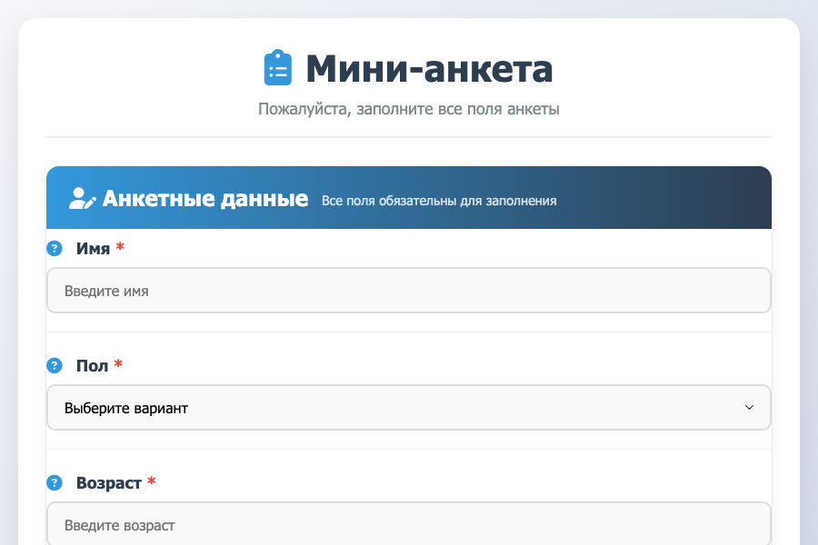
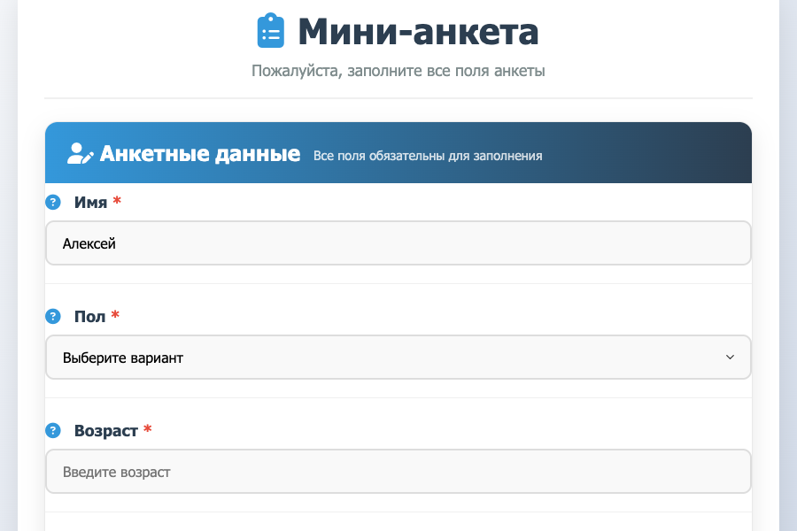

# Мини-анкета

Простое веб-приложение для сбора анкетных данных, состоящее из backend на Python (Flask) и frontend на HTML/JS.

## Функционал

### Backend (Python Flask)
- `GET /questions` – возвращает список вопросов анкеты (Имя, Пол, Возраст, Должность, Специальность)
- `POST /answers` – принимает ответы пользователя и сохраняет их в памяти (словарь)
- `GET /answers` – возвращает все сохраненные ответы (для отладки)
- `GET /health` – проверка работоспособности сервера

### Frontend (HTML/JS)
- Загружает вопросы с backend при загрузке страницы
- Отображает интерактивную форму с полями ввода
- Валидирует обязательные поля
- Отправляет заполненные ответы на сервер
- Показывает сообщение "Спасибо!" после успешной отправки
- Предоставляет возможность просмотра сохраненных ответов

## Структура проекта

```
.
├── app.py              # Backend на Flask
├── requirements.txt    # Зависимости Python
├── index.html          # Главная страница фронтенда
├── style.css           # Стили CSS
├── script.js           # Логика фронтенда на JavaScript
└── README.md           # Документация
```

## Установка и запуск

### 1. Установка зависимостей

```bash
pip install -r requirements.txt
```

### 2. Запуск backend сервера

```bash
python3 app.py
```

Сервер запустится на `http://localhost:5001`

### 3. Открытие фронтенда

Откройте файл `index.html` в браузере (двойной клик) или используйте локальный сервер:

```bash
# Например, с помощью Python
python3 -m http.server 8080
```

Затем перейдите по адресу `http://localhost:8080`

## Использование

1. Откройте приложение в браузере
2. Заполните все поля анкеты:
   - **Имя** (текстовое поле)
   - **Пол** (выпадающий список: Мужской, Женский, Другой)
   - **Возраст** (числовое поле, от 1 до 120)
   - **Должность** (текстовое поле)
   - **Специальность** (текстовое поле)
3. Нажмите кнопку "Отправить анкету"
4. После успешной отправки появится сообщение "Спасибо!"
5. Для просмотра сохраненных ответов нажмите ссылку "Просмотреть сохраненные ответы" в футере

## Технические детали

### Backend
- Использует Flask и Flask-CORS для обработки запросов
- Данные хранятся в памяти (словарь `answers_store`)
- Поддерживает CORS для взаимодействия с фронтендом
- Порт по умолчанию: 5001 (можно изменить в `app.py`)

### Frontend
- Чистый JavaScript без фреймворков
- Адаптивный дизайн с CSS Flexbox
- Валидация форм средствами HTML5 и JavaScript
- Асинхронные запросы через Fetch API

## Пример запросов API

### Получить вопросы
```bash
curl http://localhost:5001/questions
```

### Отправить ответы
```bash
curl -X POST -H "Content-Type: application/json" \
  -d '{"name":"Иван","gender":"Мужской","age":"30","position":"Разработчик","specialty":"Программирование"}' \
  http://localhost:5001/answers
```

### Получить все ответы
```bash
curl http://localhost:5001/answers
```

## Скриншоты





## Возможные улучшения

1. Сохранение данных в базу данных (SQLite, PostgreSQL)
2. Добавление аутентификации пользователей
3. Экспорт ответов в CSV/Excel
4. Пагинация для просмотра ответов
5. Более сложная валидация данных
6. Юнит-тесты для backend и frontend

## Лицензия

MIT# kurs-dz02
